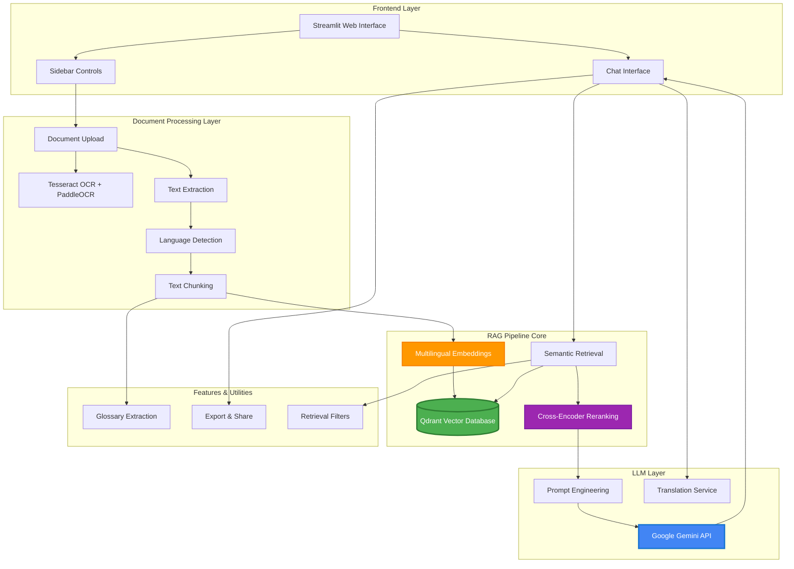
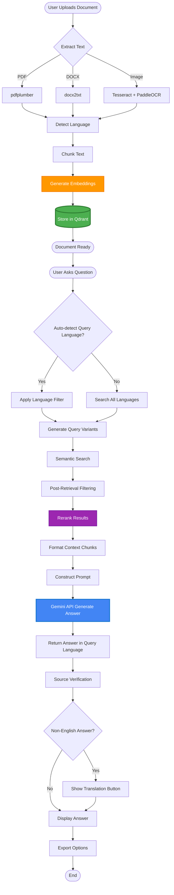
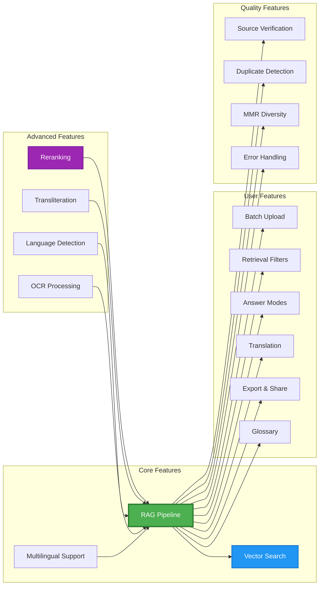
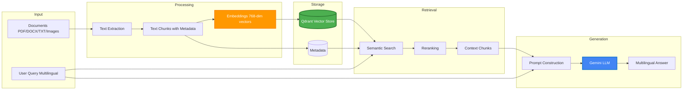

# 🏗️ Architecture & Flow Diagrams

## System Architecture Overview

## RAG Pipeline Flow

## Component Interaction Flow

## Feature Architecture

## Data Flow Diagram

## Technology Stack

## Key Features Highlight

### 1. **RAG (Retrieval-Augmented Generation)**
- **Location**: Core of the system
- **Components**:
  - Document embedding generation
  - Vector storage in Qdrant
  - Semantic retrieval
  - Context augmentation for LLM
- **Benefits**: Grounds answers in uploaded documents, reduces hallucinations

### 2. **Multilingual Support**
- **Languages**: Malayalam, Tamil, Telugu, Kannada, Tulu, English
- **Features**:
  - Language detection
  - Multilingual embeddings (multilingual-e5-large)
  - Language-specific filtering
  - Translation to English

### 3. **Advanced Retrieval**
- **Reranking**: Cross-encoder (bge-reranker-large) improves relevance
- **MMR**: Maximal Marginal Relevance for diverse results
- **Filters**: Language, source, date range
- **Post-filtering**: Removes cross-language contamination

### 4. **OCR Capabilities**
- **Tesseract**: Primary OCR engine
- **PaddleOCR**: Fallback for complex layouts
- **Preprocessing**: Denoising, thresholding, contrast enhancement

### 5. **Smart Chunking**
- Dynamic chunk sizes based on text length
- Overlap handling to preserve context
- Duplicate detection using word-level similarity

### 6. **User Experience**
- Batch document upload
- Multiple answer formats (concise, detailed, bullet, step-by-step)
- Source verification with expandable context
- Export and sharing capabilities
- Auto-extracted glossary

---

## How to View These Diagrams

1. **GitHub**: These Mermaid diagrams render automatically in GitHub markdown
2. **VS Code**: Install "Markdown Preview Mermaid Support" extension
3. **Online**: Copy diagram code to [Mermaid Live Editor](https://mermaid.live/)
4. **Documentation**: Include in README.md or documentation site

---

## Architecture Highlights

- **Scalable**: Vector database supports millions of documents
- **Multilingual**: Native support for 5+ South Indian languages
- **Accurate**: RAG + Reranking ensures relevant context
- **User-Friendly**: Intuitive UI with helpful features
- **Robust**: Multiple OCR engines and error handling
- **Flexible**: Configurable filters and answer modes

